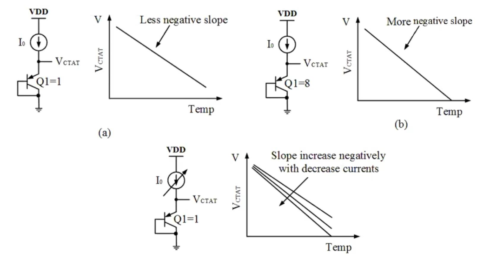

# Bandgap IP Design using Sky130 technology node

2-day hands on lab-based workshop on Analog Bandgap IP design using SKY 130, an open source 130nm PDK made available by collaboration between Google and Sky Water Technology Foundry. Workshop covers BGR are design from scratch to post layout simulation. On Day1 the course provides profound background on the theory of BGR, BGR’s description, application, implementation and need. Day 2 provide hands on experience in BGR design using ngspice, magic and netgen. After the course one will be able to understand concept of BGR, how CTAT and PTAT blocks are designed to get remove temperature dependency and implement solution to generate constant voltage as per the required specs.

## INDEX
   * [Part 1: Introduction to BGR](-##-Part-1:-Introduction-to-BGR)
   * [Part 2: Tools and PDK setup](-##-Part-2:-Tools-and-PDK-setup)
   * [Part 3: Design spec and data analysis](-##-Part-3:-Design-spec-and-data-analysis)
   * [Part 4: CTAT voltage generation circuit](-##-Part-4:-CTAT-voltage-generation-circuit)
   * [Part 5: PTAT voltage generation circuit](-##-Part-5:-PTAT-voltage-generation-circuit)
   * [Part 6: Biased current mirror circuit](-##-Part-6:-Biased-current-mirror-circuit)
   * [Part 7: Reference voltage branch circuit](-##Part-7:-Reference-voltage-branch-circuit)
   * [Part 8: Start-up circuit](-##-Part-8:-Start-up-circuit)
   * [Part 9: complete BGR circuit](-##-Part-9:-complete-BGR-circuit)
   * [Part 10: Layout of components](-##-Part-10:-Layout-of-components)
   * [Part 11: Top level extraction and LVS] (#Part 11: Top level extraction and LVS)
 * [Conclusion and Opinion] (#Conclusion and Opinion)
 * [References] (#References)
 
 
 
 
 
 ## Part 1: Introduction to BGR
 
 BGR is a temperature independent voltage reference widely used in integrated circuits. It produces a constant voltage regardless of power supply and variation in temperature.
  
 
 **Why BGR?**
 
 There is a need for a device to provide a constant voltage independent of variation in power supply and temperature. A battery drops voltage over time. A typical power supply is noisy or has ripples and IC using Zener cannot be used due to high thermal noise and unavailability of lower voltage Zener’s.

**Solution**
 + A Bandgap reference which can be integrated in bulk CMOS, Bi-CMOS or Bipolar technologies without the use of external components.

**Applications of BGR**
+ Low dropout regulators (LDO)
+ DC-to-DC buck converters
+ Analog-to-Digital Converter (ADC)
+ Digital-to-Analog Converter (DAC)

###### BGR Principle

All devices inherently either have positive temperature coefficient or negative temperature coefficient. The operation principle of BGR circuits is to sum a voltage with negative temperature coefficient with another one with positive temperature coefficient. The two-temperature coefficient are designed so as to cancel each other out so that overall resultant is temperature independent. Generally, constant current supplied into semiconductor diode behave as CTAT i.e., complement to absolute temp. So, we need to design a PTAT i.e., proportional to absolute temp (VT=KT/Q) which can cancel out the CTAT nature i.e., with rise in temp.
 

**Types of BGR**

Based on architecture there are two times
1. Self-biased current mirror: Stable and simple design but has low PSRR and needs start-up circuit.
2. Using operational amplifier

Based on application BGR is characterised into 4 types
 1.	Low-voltage BGR
 2.	Low-power BGR
 3.	High-PSRR and low noise BGR
 4.	Curvature compensated BGR

## Part 2: Tools and PDK setup

Tools used:
    +	Ngspice: It is used for the transistor level circuit simulation and design.
    +	Magic: It is used for layout design and parasitic extraction

Both Ngspice and Magic are open-source tools which need to be downloaded and installed to the work environment.   
    
Development Flow and tool used:
  
 
Next, we need we have to clone the google skywater pdk. On the terminal type git clone https://github.com/google/skywater-pdk-libs-sky130_fd_pr.git or Git clone https://github.com/silicon-vlsi-org/eda-technology

 

Once all tools and pdk are set up ensure all tools are working properly.

+	Checking all model file.    
	      
+ Checking Magic Layout generator. 
   
+ 	Checking Netgen (used to check LVS

## Part 3: Design spec and data analysis
First thing before getting into design is to define the specifications. The device needs to be operated with in the specifications. For BGR below mentioned are the general specifications.

It can be observed that for BGR the power consumption, temperature coefficient and start up time need to be low.
Well defined specification helps us in choosing the Mosfets, resistors and transistors need to design BGR. For the current design following devises will be used.

## Part 4: CTAT voltage generation circuit

If we consider constant current is flowing through a forward biased diode, then with increase in temp. we can observe that the voltage across the diode is decreasing. Generally, it is found that the slope of the V~Temp is -2mV/deg Centigarde.

While manufacturing a diode it forms a parasitic PNP transistor which leaks large current into substrate if there is a small base current. This may affect other devices present in the same substrate. In order to avoid it a diode connected transistor is used to generate CTAT. P+ diffusion is done in P-SUB and PN junction is formed in the P+ region. Now when there is base current in N+ region the large current flows from emitter to collector (P+) and doesn’t leak into P-sub.

The Diode current is defined as

............(1)

Which can be written as

............(2)

Variation of Vd wrt to temperature can be obtained by differentiating the equation 2 and it can be shown that voltage Vctat can be expressed as below

............(3)

By replacing the standard values for the above variable, it can be seen that temperature coefficient of diode connected mosfet is closed to 1.88mv/degK

The negative slope of CTAT circuit can be controlled by varying the current supplied to the transistor or by having multiple transistors connected in parallel.

Current mirror is highly dependent on VDD hence self-biased current mirror is used.  

**Implantation of CTAT:**

CTAT is implemented by connecting a constant current source to a diode connected mosfet.
Ensure to include the sky130.lib.spice TT (TT for typical- typical process) and
Sky130_fd_pr__model__pnp.model.spice
DC simulation is run from -40 deg C to 125 deg C. 
 

*Note: Lesson learnt- Be careful for additional. and typos while creating and naming files. Typos can be hard to debug in large files.( Error fix “.sp.” to “.sp”)

+ Test case1: Id=10uA, M=1. 		Resultant slope=-0.0017074

+ Test case2: Id=10uA, M=8. 		Resultant slope=-0.0019138
 

+ Test case3: Id=1.25u to10uA, M=1. 	Resultant slope=-0.0017166 to -0.00187869
 

## Part 5: PTAT voltage generation circuit

From Diode current equation (2) we can find that it has two parts, i.e.
+ Vt (Thermal Voltage) which is directly proportional to the temp(KT/Q).
+ Is (Reverse saturation current) which is directly proportional to the temp. (AukTni2), as this Is term is in denominator so with increase in temp. the ln (Io/Is) decreases which is responsible for CTAT nature of the diode. 

So, to get a PTAT Voltage generation circuit Vt needs to be separated from Is.

In the above circuit same amount of current I is flowing in both the branches. So, the node voltage A and B are going to be same V. Now in the B branch if we subtract V1 from V, we get Vt independent of Is.

From above we can see that the voltage V-V1 is PTAT in nature, but its slope is very less as compared to the CTAT, so we have to increase the slope. 
In order to increase the slope, we can use multiple BJTs as diode, so that current per individual diode will be less and it the slope of V-V1 will increase.

**Implantation of PTAT:**

PTAT is implemented by connecting a constant current source to a diode connected mosfets in node A and B with a resistor R1 connected to node B.
Ensure to include the sky130.lib.spice TT (TT for typical- typical process) and
Sky130_fd_pr__model__pnp.model.spice

qp1 result is CTAT in nature

 

V(qp1)≈V(Ra1)

In below wave form it can be observed that V(qp2) has different slope than V(ra1)

On subtracting V(ra1) V(qp2) PTAT result is obtained, Resultant slope=0.00190636

 

## Part 6: Biased current mirror circuit

For both CTAT and PTAT design it was observed previously that a constant current source is required in order to obtain the desired slope of voltage wrt to temperature. 
In a current mirror Iref sets Iout but Iout is tied closely with supply voltage. any variation in supply affects Iref and there by affecting the voltage reference. In order to improve PSRR of the system the current mirror should be able to bias itself i.e, Iref is derived from Iout.
The Self-biased current mirror is a type of current mirror which requires no external biasing. This current mirror biases itself to the desired current value without any external current source reference.

In the above circuit MP2 and MP1 copy Iout and define Iref (Iref is bootstrapped to Iout). The device is governed by Iref=K*Iout, hence it can support any current.

Rs is used to uniquely define current, loop gain is always less than 1. i.e, the circuit is generally stable and an external circuit is needed to drive the device to correct bias point.

Iout is defined by the above equation.

## Part 7: Reference voltage branch circuit

CTAT, PTAT and their current source is designed. Next step is to add CTAT and PTAT to generate the required reference voltage.
The reference circuit branch performs the addition of CTAT and PTAT voltages and gives the final reference voltage. MP3 is used as a mirror transistor to keep the current same as current mirror branches, R2 is used to scale PTAT to the same value as CTAT so that they cancel each other out and a BJT as diode in the reference branch. 

## Part 8: Start-up circuit

**Why Start-up?**

In self-biased current mirror circuit if channel length modulation is ignored there is very little dependency on the supply voltage. This leads to existence of a degenerate bias point i.e device is stable at Iin=Iout =0A. Even if the Supply is turned on there is no force to drive the currents and therefore voltage to the required operating point.
A circuit is added to drive the device into the desired operating point and once device operation reaches steady state the circuit should no longer interfere.

**Implementation of Start-up:**

In the below circuit net2 follows VDD. As net2 voltage rises greater than the threshold voltage with reference to net6 MP5 turns on there by allowing current through itself to net1. This regulates the net2 voltage and once device turns on net 6 remains at high voltage and there by isolating itself after turn on.

## Part 9: complete BGR circuit
After implementing all the blocks. The blocks are connected to get the complete BGR circuit.

**BGR Circuit Design**

**1. Current Calculation**

+ Max. power Consumption < 60uW
+ Max Total Current = 60 uW/1.8V=33.33uA (1.8V VDD)
+ So, we have chosen 10uA/branch, (3*10=30uA)
+ Start-up current 1-2 uA

**2. Choosing Number of BJT in parallel in Branch2**

+ Less number of BJT: require less resistance value but matching hampers
+ More number of BJT: requires higher resistance value but gives good matching
+ So a moderate number have chosen (8 BJT) for better layout matching and moderate resistance value.

**3. Calculation of R1**

+ R1= Vt* ln (8)/I =26 mv *ln(8)/10.7uA=5 KOhm
+ R1 size: W=1.41um, L=7.8um, Unit res value: 2k Ohm
+ Number of resistance needed: 2 in series and 2 in parallel (2+2+(2||2))

**4. Calculation of R2**

+ Current through ref branch:I3=I2=Vt*ln(8)/R1
+ Voltage across R2: R2I3=R2/R1(Vtln(8))
+ Slope of VR2= R2/R1 (ln(8)*115uv)/Deg Cent.
+ Slope of VQ3=-1.6mV/Deg cent
+ Adding both and equating to zero, R2 will be around 33k Ohm
+ Number of resistance needed: 16 in series and 2 in parallel (2+2...+2+ (2||2))

**5. SBCM Design (Self-biased Current Mirror)**

**A. PMOS Design in SBCM**
+ Make both the MP1 and MP2 well in Saturation
+ To reduce channel length modulation used L=2um
+ Finally the size is L=2u, W=5u and M=4

**B. NMOS Design in SBCM**

+ Make both the MN1 and MN2 either in Saturation or in deep sub-threshold
+ We have made it in deep sub-threshold
+ To reduce channel length modulation used L=1um
+ Finally the size is L=1u, W=5u and M=8

**Final Circuit**

**Implementation**

**BGR using Ideal OpAmp**
After all blocks are done. BGR with VCVS or opamp is tested.

In this simulation we should get the reference voltage as an umbrella shaped curve.

CTAT:

PTAT:

CTAT + PTAT = VREF

**BGR with Start-up (SBCM)**

With SBCM it is necessary to implement start-up circuit. Transient analysis is run to observe start-up behaviour of the circuit.
Vref rises as VDD increases and it can be observed start-up time is ≈1.25us which is < 2us specification.

Voltage changes in net1 and net2, it can be observed during start up net2 follows vdd and after start up both settle at regulated value.

Below waveform shows how on net6 goes high and turns off startup circuit once device reaches desired operating point.

Start -up current waveform

To see effects of not using a start-up circuit, Start-up block was disable in SBCM configuration.

It can be observed that net 1 doesn’t go above 0.2V and Vref remains at a lower stable point. Large start up current can be observed. 

## Part 10: Layout of components

Now after getting our final netlist, we have to design the layout for our BGR. Layout is drawing the masks used in fabrication. We are going to use the Magic VLSI tool for our layout design.

###### Getting started with Magic
Magic is an open-source VLSI layout editor tool. To launch magic open terminal and write the following command.

$ magic -T /home/<path for sky130A.tech>/sky130A.tech 

Now it will open up two windows, those are tkcon.tcl  where we design and edit our Layout 

Now device wise we have the following devices in our circuit.
+ PFETS
+ NFETS
+ Resistor Bank
+ BJTs

